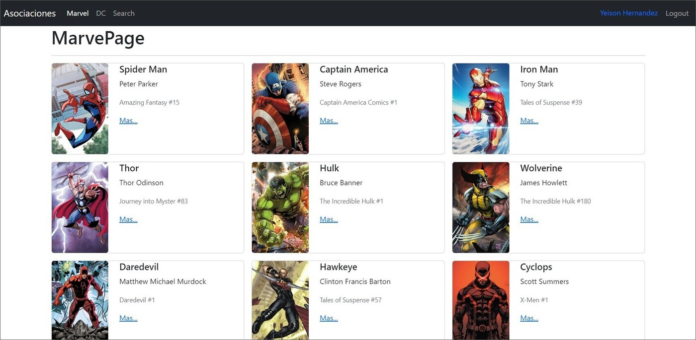
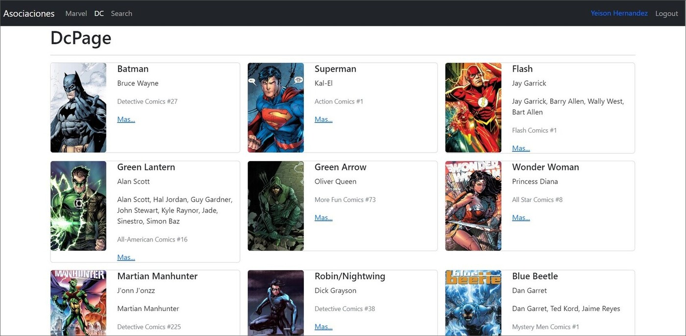

# Heroes App
Esta página web fue creada con React, utiliza Vite y TypeScripts. Permite mostrar datos de algunos superhéroes de Marvel y DC con su respectiva imagen. Además, se realizan pruebas unitarias con Jest y para los estilos se utilizó Bootstrap 5 y CSS.

## Tecnologías principales
-  React  
-  Vite  
-  TypeScripts  
-  Jest  
-  Bootstrap 5  
-  CSS

## Capturas de pantalla
Se incluyen capturas de pantalla en desktop para tener una mejor visualización del proyecto.

## Créditos
Este proyecto fue creado a partir de un curso de Udemy llamado “React: De cero a experto ( Hooks y MERN )” dictado por Fernando Herrera. El enlace al curso es https://www.udemy.com/course/react-cero-experto/.

## Enlace
Puedes ver la página web en funcionamiento en el siguiente enlace: [Live site URL](https://todo-app-yha.netlify.app/).
